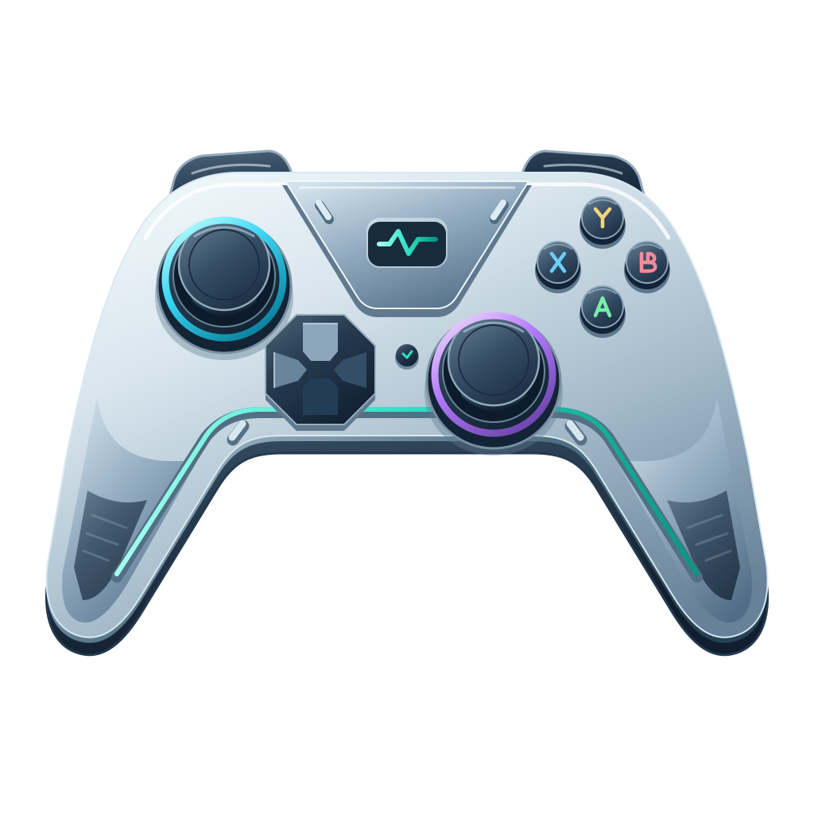

  

<h1 align="center">GamePadTester</h1>

  
  
  
  
  
  
  

<b>스틱 원형도와 폴링레이트를 정밀하게 재는 Windows용 게임패드 테스터</b> 
버튼·트리거·진동·자이로·터치패드 점검, Gamepadla 실측 데이터 비교, 결과 카드 이미지 저장까지 한 프로그램에서.

  

  

  
  
  
  
  
  

  
  
  
  

---

## ✨ 무엇을 할 수 있나요

### 🎯 스틱 원형도 평균값 측정

개요에서는 원 모양의 스틱 그림과 실시간 X·Y 축 값을 확인합니다. 원형도 측정은 **스틱** 화면에서 시작합니다.
- **평균 오차는 [gamepad-tester.com](https://hardwaretester.com/gamepad)과 같은 방식**으로 계산합니다. 32개 방향(11.25°)마다 가장 멀리 닿은 거리 r을 기록하고 √(평균((1 − r)²)), 즉 RMS 오차를 냅니다. 같은 패드라면 두 곳의 값을 그대로 비교할 수 있습니다.
- 스틱이 가장자리에 처음 닿은 뒤 **10초가 지나면 저절로 끝나고**, 등급은 우수·양호·보통·미흡으로 나눕니다.
- 최대 오차, 모양 오차, 편심률(찌그러짐), 외곽 도달률, 사각형 출력 여부를 함께 보여 줍니다.
- 결과는 32구간 쐐기(부채꼴)로 그립니다. 기준 원에서 벗어난 구간일수록 빨갛게 표시해서, 어느 쪽이 덜 닿거나 튀어나왔는지 한눈에 보입니다.
- 중심·드리프트(5초 동안 놓았을 때 남는 값과 흔들림), 해상도(단계 수와 비트), 스냅백(놓았을 때 반대로 튀는 정도)도 잽니다.
- 스냅백은 시작 후 **최대 15초에 자동 종료**하며, 남은 시간과 완료 알림을 보여 줍니다. 다른 화면으로 이동해도 측정이 끝납니다.
- **데드존을 임의로 적용하지 않습니다.** 원시 값 그대로 재기 때문에 패드에 내장된 데드존과 축 스냅핑을 찾아낼 수 있습니다. SDL이 Y축을 뒤집으며 생기는 한 단계 어긋남도 입력 코어가 되돌려, 가만히 둔 스틱은 패드가 보낸 값 그대로 보입니다.

### 📶 폴링레이트 측정
- **자동 측정**은 XInput 패킷 또는 SDL의 스틱 입력 변화를 사용합니다. 이 두 방식에만 **중심 5% 데드존**을 적용해 미세 떨림으로 측정이 진행되는 것을 막습니다. 원형도·드리프트·원시 입력 값에는 적용하지 않습니다. HID 직접 측정은 전체 보고서 도착 간격을 재므로, 듀얼센스처럼 정지 상태에서도 보고서를 보내는 패드는 스틱을 움직이지 않아도 측정됩니다. HID 방식에는 스틱 선택·중심 데드존이 적용되지 않습니다.
- C++ 전용 스레드가 측정합니다. **XInput 패킷**은 바쁜 대기로 감시하고, **HID 원시 보고서**는 도착 시각을 나노초 단위로 기록하며, SDL 보고서 방식도 고를 수 있습니다.
- 통계는 [Gamepadla](https://gamepadla.com)와 같은 방식(아래 2%·위 0.5% 제외 → 최소·평균·최대·지터)으로 계산해 바로 비교할 수 있습니다.
- 결과는 **소수점까지** 보여 줍니다(평균 보고율은 소수 둘째 자리, 간격·지터는 0.0001 ms). 1,000 Hz 패드도 '1,000'으로 뭉뚱그려지지 않고 '999.98 Hz'처럼 실제로 잰 값이 보입니다.
- 화면에는 보고율(중앙값·최대·최소), 간격(평균·최대·최소), 지터·안정도·이상치를 3×3으로 보여 주고 표준 등급(125~8000 Hz)도 붙입니다. 누락 추정과 버퍼 지연은 내보낸 파일에 들어갑니다.
- 표본 수는 2,000·4,000·8,000개 중에서 고릅니다(기본 4,000). 8 kHz 패드도 스틱을 돌릴 시간이 충분합니다.
- 간격 산점도·분포·색으로 구분한 간격 기록을 보여 주고, JSON(Gamepadla 호환 키)·CSV·TXT로 내보냅니다.
- 개요 화면에서도 스틱을 가장자리 쪽에서 계속 돌리면 패드 그림 아래에 **대략적인 폴링레이트**(예: ≈ 998 Hz)가 나타납니다. 표준값으로 반올림하지 않고 잰 값을 그대로 보여 줍니다. XInput 패드는 패킷 번호로 세므로 2K·8K 패드도 근사값이 나옵니다.
- 지터 등급은 간격의 흔들림을 ms로 매깁니다(0.5 ms 이하 우수). 고주사율 패드가 비율 때문에 괜히 나쁘게 나오지 않습니다.

### 🔴 DualSense USB OverClock

**일반 Sony DualSense**를 USB 케이블로 연결하면 장치 이름 옆에 빨간색·흰 글자의 `OverClock` 버튼이 나타납니다. **한 번 누르면 1000 Hz 적용, 다시 누르면 원래 설정 복원**입니다. 적용하면 `OverClock ON`으로 표시하며, 앱 재실행·패드 전환 후에도 실제 장치 설정과 백업을 조회합니다. 옆 정보 버튼에서 설명과 **HID 보고율 확인**을 엽니다.

대상 모델은 VID:PID 고정값이 아니라 연결했을 때 **Gamepadla에서 Verified로 확인된 모델**로 정합니다. 일반 DualSense로 확인된 패드에만 버튼이 나타나며, Gamepadla 목록을 아직 읽지 못했거나 모델이 확인되지 않으면 나타나지 않습니다. **DualSense Edge는 기본 상태에서 이미 약 1000 Hz로 보고해 효과가 없으므로 지원하지 않습니다**(실측: 기본·적용·해제 모두 약 999.6 Hz). 블루투스와 다른 패드에도 적용되지 않습니다.

관리자 권한을 승인하면 [HIDUSBF](https://github.com/LordOfMice/hidusbf)의 서명된 NoPatch 드라이버 원본을 해시·서명 검증 후 설치합니다. 설정을 바꾸기 전에는 Sony USB 복합 장치의 HID 인터페이스인지 하드웨어 경로를 다시 확인합니다. 해당 DualSense만 자동 재연결하고, 자동 재연결이 불가능할 때는 USB 케이블을 다시 연결하도록 안내합니다. 원래 설정을 백업하며 다른 장치와 기존 필터는 보존합니다. Windows x64 전용입니다.

다른 패드와 함께 연결해도 작업 대상과 슬롯을 유지합니다. 재연결이 끝날 때까지 패드 전환과 중복 적용을 잠그며, 폴링 측정 중에는 적용할 수 없습니다.

실제 USB DualSense의 장치 버튼으로 **해제 249.97 Hz → 재적용 999.53 Hz(1.0005 ms)**를 확인했습니다. 해제는 저장한 원래 설정으로 돌아가는 동작입니다. 이름 옆 정보(i) 버튼의 설명 창은 안내와 `HID 보고율 확인`만 제공하며, 적용·복원은 OverClock 버튼으로 합니다. `HID 보고율 확인`은 설정 목표 대신 실제 보고서 도착 간격을 측정합니다. USB 보고율이 높아져도 게임의 입력 지연이나 펌웨어 내부 샘플링이 같은 비율로 개선된다는 의미는 아닙니다.

  
  

### 🖼️ 결과 카드 이미지
원형도·드리프트·폴링 결과를 **800×400 PNG**로 저장합니다. 설정에서 이미지 폴더를 고르면 창 캡처와 결과 카드가 그곳에 바로 저장됩니다. 원형도는 원 그림·평균 오차·등급을, 드리프트는 두 스틱의 중심 오차·등급·흔들림·최대 편차·평균 AXIS 0~3 좌표·표본 수를, 폴링은 평균 보고율·최대·최소 보고율·평균 간격·지터를 담습니다. 카드에는 장치 이름과 측정 완료 시각도 표시합니다. 폴링 카드의 숫자는 천 단위 쉼표 없이 소수점만 표시합니다(예: 1000.00 Hz).

스틱의 이미지 저장은 **원형도·드리프트 완료 결과**를 지원합니다. 드리프트 측정이 끝나면 `이미지 저장`이 켜지며, 준비·측정 중에는 꺼집니다. 스냅백 이미지 저장은 아직 지원하지 않습니다.

  
  
  

### 🎮 패드에 맞춘 화면
- 최대 **4개 패드**를 동시에 연결할 수 있습니다. 장치명·VID:PID·연결 방식이 보이는 탭으로 바꿔 보며, 결과는 패드별로 보존합니다. 패드 탭을 바꾸면 진행 중인 원형도·폴링 측정은 중지합니다. 같은 패드에서 페이지를 이동할 때는 측정이 계속됩니다. 탭의 VID:PID(XXXX:YYYY)를 누르면 복사되어 여러 패드의 ID를 모으기 쉽습니다.
- 패드가 알려 주는 이름은 'XInput Controller #1'처럼 일반적인 경우가 많습니다. 선택된 탭의 이름을 누르면 **이름을 직접 붙일 수 있고**(Enter로 저장, 비우면 원래 이름), Steam처럼 VID:PID별로 기억해서 다음에 연결해도 그 이름으로 보입니다. 붙인 이름은 결과 카드·내보내기·Gamepadla 자동 매칭에도 쓰입니다.
- 직접 붙인 이름이 없으면 Gamepadla에서 **Verified**로 확인된 모델명을 탭 이름에 자동으로 씁니다. 장치 화면을 열지 않은 패드에도 적용됩니다.
- 패드 그림은 실제 컨트롤러 정면 사진에서 딴 윤곽과 버튼 위치로 그립니다(좌우 대칭으로 다듬음). XInput 패드는 Xbox Series 컨트롤러, DualSense·DUALSHOCK 4는 DualSense, ProCon 2·Switch Pro 컨트롤러는 ProCon 2 모양으로 그리고, 닌텐도 패드는 A가 오른쪽·B가 아래인 닌텐도식 배치를 따릅니다. Elite 패들, DualSense Edge 후면 버튼, GL/GR도 손잡이 아래에 따로 보여 줍니다.
- 무선 수신기가 덧붙여 내보내는 가짜 장치(축 없는 HID 인터페이스)는 자동으로 걸러 냅니다.

### 🔎 그 밖의 점검
| 화면 | 내용 |
|---|---|
| 버튼·트리거 | 누름 횟수·누른 시간·간격, 최대 동시 누름·반대 방향 동시 입력, 채터링 감지, 트리거 정지값·최대값·해상도·그래프 |
| 진동 | 좌우 모터 세기·시간·패턴, Xbox 트리거 진동, DualSense·DualSense Edge 적응형 트리거 |
| 모션·터치 | 자이로·가속도 그래프와 보고율, 정지 바이어스·노이즈 캘리브레이션, 3D 자세, 터치패드 손가락 위치 |
| 기타 | DualSense LED(라이트바) 색 |
| 장치·Gamepadla | 이름 후보·VID:PID·펌웨어·입력 경로·기능, Gamepadla 실측 지연(읽기 전용)과 내 폴링 결과 비교 |

적응형 트리거는 진동 화면에서 저항·걸림 지점·진동 저항을 고르고 L2/R2를 눌러 확인합니다. 현재 선택한 버튼을 강조하며 패드별로 선택 상태를 유지합니다. **끄기**를 누르면 효과를 해제합니다.

Edge는 뒤쪽 L2/R2 스토퍼를 **맨 위(긴 스트로크)**로 두세요. 긴 스트로크여도 사용 중인 프로필의 트리거 효과 강도가 **끔**이면 저항이 나오지 않습니다. 앱이 해당 프로필을 읽어 안내하면 **Fn+△로 기본 프로필을 선택**하거나 PlayStation Accessories에서 트리거 효과 강도를 켠 뒤 다시 시험하세요. 앱은 저장 프로필을 변경하지 않습니다. [Sony 설정 안내](https://controller.dl.playstation.net/controller/lang/en/2100005.html)

실제 패드를 연결하거나 선택하면 장치 화면을 열기 전에 Gamepadla 정보를 미리 불러옵니다. 패드 사진은 더 크게, 원래 비율로 표시합니다. 모델 검색은 여러 후보를 함께 보여 주며, 모델을 기억해 두면 다른 후보를 살펴본 뒤 장치 화면으로 돌아왔을 때 저장한 모델로 복원됩니다.

정지 상태에서도 자이로에는 작은 영점 오차와 노이즈가 남을 수 있습니다. 그래프는 최소 ±10°/s 범위로 표시해 미세 노이즈를 큰 움직임처럼 확대하지 않고, 현재 값은 소수 둘째 자리까지 보여 줍니다. 큰 움직임에는 표시 범위가 자동으로 넓어지며, 원래 센서 값은 유지합니다.

### ProCon 2(Switch 2 Pro 컨트롤러)를 연결할 때

**USB 케이블로 연결**하면 앱이 패드를 PC 모드로 자동 전환해 버튼·스틱·자이로·진동을 시험할 수 있습니다. 별도 드라이버나 설정 도구는 필요 없습니다.

- 블루투스 연결은 지원하지 않습니다.
- Steam이나 브라우저 설정 도구(procon2tool 등)가 같은 패드를 쓰고 있으면 앱이 전환하지 못해 입력이 들어오지 않습니다. 이때 앱이 안내를 띄우니, 해당 프로그램을 닫고 USB 케이블을 다시 연결하세요.
- PC 모드로 전환되지 않은 상태에서 홈 버튼을 누르면 페어링된 Switch 2 본체가 켜질 수 있습니다.

### Flydigi APEX 시리즈의 모션(자이로)가 표시되지 않을 때

APEX 5에는 자이로가 있지만, XInput 연결만으로는 앱에 센서 데이터가 전달되지 않습니다. 다음 설정이 필요합니다.

1. [Flydigi 공식 다운로드 페이지](https://shops.flydigi.com/pages/game-center)에서 **Flydigi Space Station**을 설치합니다.
2. Space Station에서 패드 펌웨어를 최신 버전으로 업데이트합니다.
3. **타사 앱이 매핑을 제어하도록 허용** (Allow third-party apps to take over mappings) 을 켭니다.
4. 패드를 다시 연결하고 GamePadTester의 **모션** 화면을 엽니다.

앱은 같은 패드의 두 경로가 확인되면 모션을 제공하는 전용 경로를 한 탭에 표시합니다. 모션 활성화 상태에서는 폴링 소스를 **자동**으로 두세요. 전용 입력을 이미 읽고 있는 SDL 경로로 측정하므로 모션과 함께 사용할 수 있습니다. 타사 앱 허용을 끄면 모션 화면에서 설정 방법을 안내합니다. 같은 모델 여러 대를 연결해 대응 관계를 확정할 수 없을 때는 각 입력 경로를 따로 표시합니다.

앱을 정상 종료하면 사용한 전용 경로에 제어권 해제 명령을 보냅니다. **Steam Input이나 다른 SDL 기반 앱도 같은 패드를 사용할 수 있어**, GamePadTester를 닫아도 Space Station의 '타사 앱에서 제어 중' 표시가 유지될 수 있습니다. 그럴 땐 스팀 클라이언트를 종료하거나 설정에서 타사 허용을 껐다가 키면 해결 됩니다. 

### ⚙️ 편의 기능
- **SHA-256으로 검증하는 자동 업데이트**: 앱을 시작할 때마다 새 버전을 확인합니다(설정의 `지금 확인`으로도 확인). 독립된 창 하나에서 전체 릴리스 내역과 단계별 진행 상황을 확인합니다. GitHub 릴리스의 파일 해시를 검증한 뒤 설치하고, 실패하면 이전 버전으로 되돌립니다. 성공하면 앱을 다시 실행하고 5초 후 업데이트 창을 닫습니다.
- 한국어·English·日本語·简体中文·繁體中文·Español, 다크테마·라이트테마와 강조색. 기본값은 시스템 테마이며 Windows의 앱 모드 설정을 따릅니다. 창은 Windows 배율에 맞춘 고정 크기로 주 모니터 중앙의 개요 화면에서 시작합니다.
- 창 전체 캡처(Ctrl+Shift+S), 페이지 전환(Ctrl+1~9), 패드 전환(Alt+1~4).
- 최소화하면 알림 영역(트레이)으로 숨기기(설정에서 켜기, 트레이 메뉴: 창 열기·업데이트 확인·GitHub 열기·종료). 창을 닫을 때는 항상 종료할지 묻습니다.
- 여러 번 실행해도 창은 하나만 열리고, 다시 실행하면 최소화하거나 숨긴 기존 창을 보여 줍니다.
- 설치가 필요 없는 포터블 앱입니다. 설정·캐시는 실행 파일 옆에, 측정 텍스트는 `report/`를 기본 위치로 씁니다. 이미지 저장 위치는 기본 `/images` 이며 설정에서 바꿀 수 있고, 화면 캡처·결과 이미지는 해당 폴더에 바로 저장합니다.

---

## 📸 화면

| 스틱 분석 | 폴링레이트 |
|---|---|
|  |  |
| **버튼·트리거** | **진동** |
|  |  |
| **모션·터치** | **장치·Gamepadla** |
|  |  |

---

## 📥 내려받기와 실행
1. [Releases](https://github.com/deuxdoom/GamePadTester/releases/latest)에서 최신 버전 ZIP(예: `GamePadTester_v320.zip`)을 받습니다. GamePadTester는 공식 릴리스에서만 배포하니, 다른 곳에 올라온 파일은 받지 마세요.
2. 원하는 폴더에 압축을 풀고 `GamePadTester.exe`를 실행합니다. 바탕화면이나 문서 폴더처럼 쓰기 권한이 있는 곳을 권장합니다.
3. 'Windows의 PC 보호' 창이 뜨면 **추가 정보 → 실행**을 누릅니다. 코드 서명을 하지 않은 프로그램이라 처음 한 번 나타날 수 있습니다.

다음 버전부터는 프로그램이 새 버전을 알려 주고, `지금 업데이트`를 누르면 알아서 바꿉니다.
받은 파일이 원본과 같은지는 릴리스 본문의 SHA-256 값으로 확인할 수 있습니다.

> **2.x에서 넘어오는 경우**: v3는 완전히 새로 만든 버전이라 자동 업데이트로 넘어가지 않습니다. 새 폴더에 압축을 풀어 사용하세요.

### 정확하게 재려면
- **원형도**: 스틱 화면에서 `원형도 측정`을 누르고 스틱을 가장자리에 붙인 채 돌립니다. 가장자리에 닿은 뒤 10초가 지나면 저절로 끝나니, 그동안 바깥쪽으로 힘을 준 채 두세 바퀴 이상 돌리면 됩니다.
- **폴링레이트**: 패드를 USB 허브 없이 PC에 바로 연결하고, 측정이 끝날 때까지 고른 스틱을 빠르게 원을 그리며 돌립니다.
- **모션 센서**: 모션 센서를 지원하는 패드를 평평한 곳에 놓고 `정지 보정`을 누릅니다. 3초 동안 움직이지 않은 뒤, 기울이거나 돌려 자이로·가속도 반응을 확인합니다.

---

## 🙏 출처와 라이선스
- 프로그램: [GamePadTester 프리웨어 라이선스](LICENSE) © deuxdoom. 누구나 무료로 사용할 수 있지만, 수정·역설계·재배포는 허용하지 않습니다. 3.2.0 이하 버전은 배포 당시 함께 제공한 라이선스를 따릅니다.
- [SDL 3](https://libsdl.org)(zlib), [Qt for Python](https://www.qt.io/qt-for-python)(LGPL v3), [Pretendard](https://github.com/orioncactus/pretendard)·[JetBrains Mono](https://github.com/JetBrains/JetBrainsMono)(SIL OFL 1.1), [Fluent UI System Icons](https://github.com/microsoft/fluentui-system-icons)(MIT), [GitHub Octicons](https://github.com/primer/octicons)(MIT). 라이선스 원문은 각 링크에서 볼 수 있습니다.
- SDL 3.4.16은 ProCon 2의 USB 초기화를 위해 libusb를 켜고 소스에서 직접 빌드했습니다. [libusb](https://github.com/libusb/libusb)(LGPL 2.1) 1.0.30 공식 DLL을 수정 없이 포함하며, 라이선스 원문은 앱 폴더의 `bin/gamepadtester/assets/libusb/`에 있습니다. LGPL 구성 요소(Qt for Python, libusb)는 해당 라이선스에 따라 교체·수정할 수 있습니다.
- [HIDUSBF](https://github.com/LordOfMice/hidusbf): SweetLow / LordOfMice의 서명된 NoPatch 드라이버·INF 원본을 포함합니다. [저작자의 Public Domain 배포 허용 안내](https://github.com/LordOfMice/hidusbf/issues/407), 고정 커밋·해시·출처는 앱 폴더의 `bin/gamepadtester/assets/overclock/SOURCE.json`에 기록했습니다.
- 앱 아이콘: GamePadTester 자체 디자인 © deuxdoom. 프로그램과 같은 라이선스를 따르며, 메뉴에 쓰는 Fluent 아이콘과 별개입니다.
- 지연 데이터: [Gamepadla](https://gamepadla.com)(읽기 전용으로 조회하며, 아무것도 올리지 않습니다). 폴링 통계 방식은 [cakama3a/Polling](https://github.com/cakama3a/Polling)을 참고했습니다.
