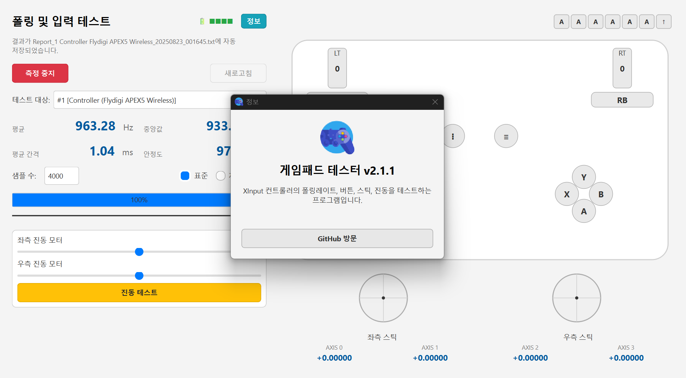

  

  

<h1 align="center">GamePadTester</h1>

  
  
  
  
  
  
  
  

> 윈도우용 XInput 게임패드 테스터: 폴링레이트 측정, D-Pad/ABXY등 버튼 테스트, 스틱 AXIS 측정, 진동 테스트

---

## 📘 프로그램 설명
**GamePadTester**는 XInput 기반 컨트롤러의 입력 변화를 고속 샘플링해 폴링 특성을 수치화하고 버튼이나 진동 등 테스트 가능한 앱입니다.

---

## ✨ 핵심 기능
- **폴링레이트 분석**: 평균/중앙값(Hz·ms), 안정도(%), 샘플 수(1000/2000/4000/8000/16000) 선택
- **측정 진행도**: 폴링레이트 측정시 직관적으로 진행도를 알 수 있게 표시
- **버튼 시각화**: D-Pad와 ABXY, **LB/RB / OPTION(≡)·MENU(⁝) / L3·R3** 상태 표시
- **스틱 AXIS**: 좌·우 스틱의 AXIS 값 측정
- **진동 테스트**: 좌·우(저주파/고주파) 모터 강도 슬라이더
- **결과 저장**: 폴링 레이트 측정 종료와 함께 측정값을 **TXT**로 자동으로 저장
- **장치명 표시**: `pygame`을 통해 연결된 게임 패드 장치명 표시

---

## ✅ TODO

- [ ] 🎮🔗 패드 다중 추가 시 **연결된 패드명 ↔ 실제 장치명** 불일치 문제 개선 예정

---

## 📥 다운로드
- [Releases 페이지](https://github.com/deuxdoom/GamePadTester/releases)로 이동합니다.
- 최신 버전(예: `v1.0.0`) 선택 → **Assets**에서 **ZIP파일** 다운로드 예) GamePadTester_xxx.zip`
- ZIP을 받은 경우 **압축 해제** 후 `GamePadTester.exe` 실행
- SmartScreen이 뜨면 **`추가 정보` → `실행`** 선택 (자세한 내용은 아래 *주의사항*)
- 권장: `Program Files`보다 **사용자 폴더(바탕화면/문서 등)** 에서 실행

---

## ⚠️ 주의사항
- **대상 OS/장치**: Windows 10/11, XInput 호환 컨트롤러(예: Xbox Series/One 패드, 일부 호환 제품)
- **SmartScreen 경고(서명 미적용 EXE)**: “Windows에서 PC를 보호함” 메시지가 뜰 수 있습니다. 신뢰 가능한 출처임을 확인한 뒤, **`추가 정보` → `실행`**을 누르세요. 파일 `속성`에서 **차단 해제** 체크 후 실행하면 경고가 줄어듭니다.
- **백신 오탐 가능성**: 자체 빌드/압축 방식에 따라 간헐적 오탐이 있을 수 있습니다. **Releases** 배포본 사용을 권장합니다.
- **관리자 권한**: 일반 사용자 권한으로 동작. 특정 드라이버/무선 동글 환경에선 진동 기능이 제한될 수 있습니다.

---

## 🔗 참고
- XInput 샘플/아이디어  
  - https://github.com/chrizonix/XInputTest  
  - https://github.com/cakama3a/Polling

## 🙏 크레딧
- 아이콘: <a href="https://www.flaticon.com/free-icon/game-control_1722368">Game control</a> by <a href="https://www.flaticon.com/authors/freepik">Freepik</a> from <a href="https://www.flaticon.com/">Flaticon</a>. 이 아이콘은 Flaticon 라이선스에 따라 사용되며, 출처 표기가 필요합니다.

## 📄 라이선스
[LICENSE](LICENSE) 참고.
